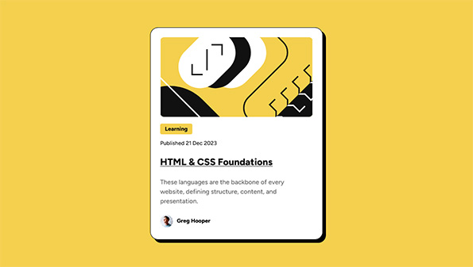
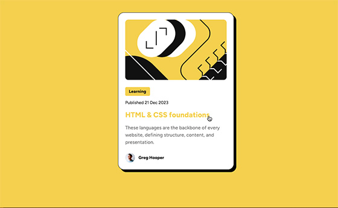

# Frontend Mentor - Blog preview card solution

This is a solution to the [Blog preview card challenge on Frontend Mentor](https://www.frontendmentor.io/challenges/blog-preview-card-ckPaj01IcS). Frontend Mentor challenges help you improve your coding skills by building realistic projects. 

## Overview
This is my attempt at replicating & improving this blog challenge.

### The challenge

Users should be able to:

- See hover and focus states for all interactive elements on the page _(`<h1>` in this case)_

### Screenshot
|          My Solution           |        Goal         |
|:------------------------------:|:-------------------:|
|  |  |

### Links
- [Submission Page](https://www.frontendmentor.io/solutions/blog-preview-card-pure-css-GT2ZIpqJCi)
- [Live Site](https://blankztheather.github.io/blog-challenge/)
